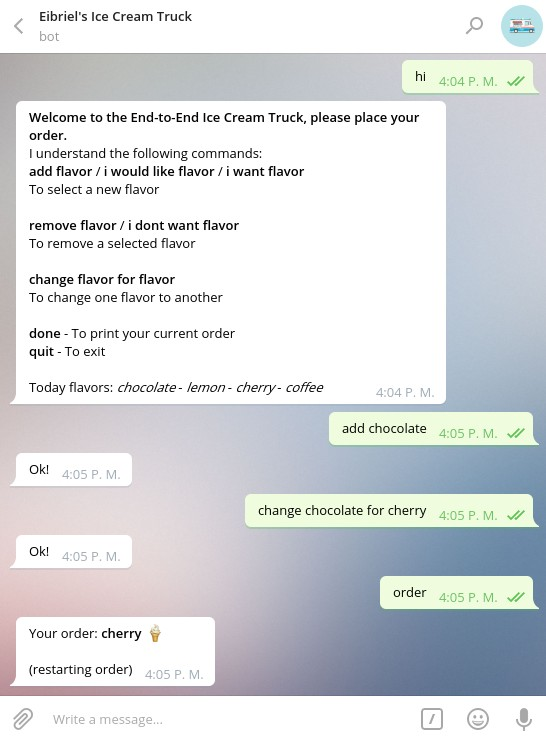

# Ice Cream Truck bot
This chatbot allows you to place an order of Ice Cream in a [Random Access Navigation](https://medium.com/assist/theres-a-dozen-ways-to-order-a-coffee-why-do-dumb-bots-only-allow-one-27230542636d) way, using a Memory Neural Network.

Entry for machine learning tutorial [How to Make a Chatbot - Intro to Deep Learning #12](https://www.youtube.com/watch?v=t5qgjJIBy9g)


## Dependencies
- python 3
- keras
- requests (For Telegram support)

## Running 
To run the command line interface, just type:
`python chatbot.py`
The bot will use the included pre trained model, if you want to train your own remove the file `model.hdf5`

## CLI interface
Interaction example:

```
Welcome to the End-to-End Ice Cream Truck, please place your order.
I understand the following commands:
add flavor / i would like flavor / i want flavor
To select a new flavor

remove flavor / i dont want flavor
To remove a selected flavor

change flavor for flavor
To change one flavor to another

done - To print your current order
quit - To exit

Today flavors: chocolate - lemon - cherry - coffee

>add chocolate
>change chocolate for cherry
>add coffee
>done


Your order: cherry, coffee 🍦

(restarting order)


>quit
```

## Telegram interface
In order to use a Telegram bot as your interface:

- Install [Telegram](https://telegram.org)
- Add BotFather to your contancts: https://t.me/BotFather
- Use the `/newbot` command and follow the instructions
- On the code duplicate the file `sample_config.py` to `config.py`
- From BotFather copy the bot token to `config.py`
- Run the chatbot with the following parameter `python chatbot.py telegram`

Done! You can now add your bot to your contacts and order your Ice Cream

My demo on Telegram: https://t.me/eibriel_icecream_bot


